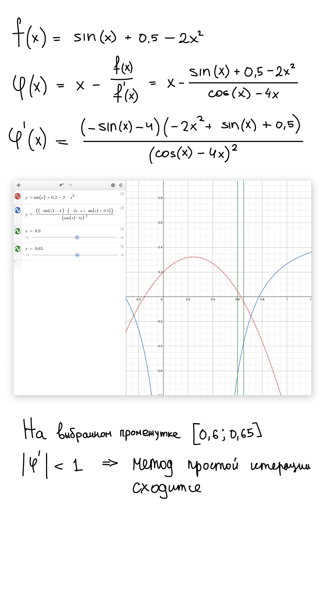

# Задача

Дано уравнение f(x) = 0. Найти один корень этого уравнения с точностью ε = 0.5 · 10−5
,используя разные методы отыскания корня.


Методы решения:
1. метод половинного деления;
2. метод Ньютона;
3. модифицированный метод Ньютона;
4. метод хорд;
5. метод подвижных хорд;
6. метод простой итерации.

----

В отчете:
- обосновать выбор отрезка [a, b];
- в методах 2 – 5 обосновать выбор начальной точки;
- в методе 6 обосновать выбор функции φ(x) и доказать сходимость метода;
- сравнить скорости сходимости предложенных методов.

----

Мой вариант: 20

Моя функция: `f(x) = sin(x) + 0.2 − 2x^2`

# Решение

## Отчет:

```
Отчет:

Функция: sin(x) + 0.5 - 2x * x
Старт: 0.6, Конец: 0.65. Погрешность: 5e-7

1. Метод половиного деления
Решение: 0.6272708892822266, Итераций: 17

2. Метод Ньютона
Решение: 0.62727079106085, Итераций: 5

3. Модифицированный метод Ньютона
Решение: 0.6272707983540341, Итераций: 6

4. Метод хорд
Решение: 0.6272707892775534, Итераций: 7

5. Метод подвижных хорд
Решение: 0.6272707910598836, Итераций: 6

6. Метод простой итерации
Решение: 0.62727079106085, Итераций: 5

```

## Обоснования:

- обосновать выбор отрезка [a, b]:
> Был выбран отрезок 0.6 - 0.65 графическим методом ([нарисовал через Desmos](https://www.desmos.com/calculator/xulhrh14it?lang=ru))
> 
> Проверим: f(left)*f(right) < 0 = -0.001777377322689592 < 0

- в методах 2 – 5 обосновать выбор начальной точки;
> Выбор нужного конца отрезка (или начальной точки) основывается на формуле: f(x)*f''(x) > 0. Если это выполняется, то выбирается этот конец отрезка.
> 
> Была выбрана точка B (0.65) т.к f * f'' = 0.13515973104380263 > 0

- в методе 6 обосновать выбор функции φ(x) и доказать сходимость метода;
> Обоснование выбора Phi можно подсмотреть на картинке
> 
> 

- сравнить скорости сходимости предложенных методов.
> Из выкладок видно, что быстрее всего к решению сходится метод простой итерации и метод Ньютона. Хотя справедливости ради, стоит заметить, что в данном конкретном случае, благодаря выбору функции Phi как x - f/f'(x) метод простой итерации эквивалентен методу ньютона
>
> PS Я так сделал не специально :( 
> 
> В то время как метод половинного деления сходится медленнее всего

## Модуль:

### Пре-реквизиты:

- Node >= 12

### Запуск:

- `node index.js`
